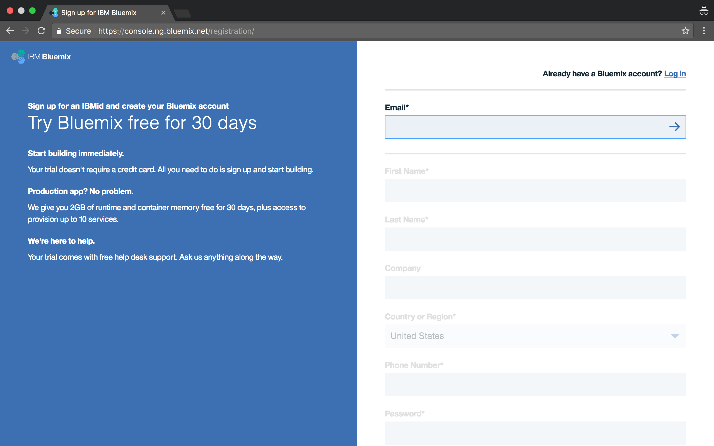
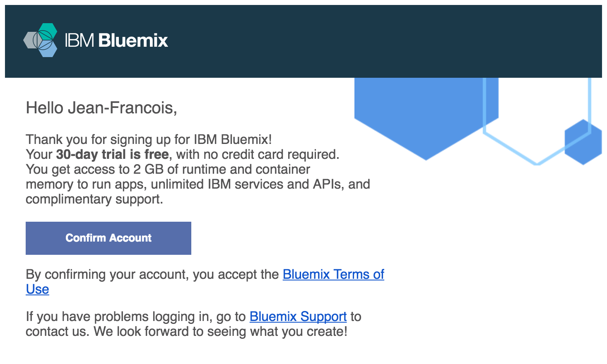
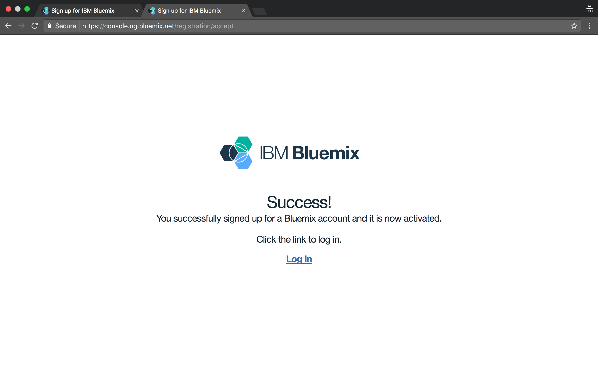
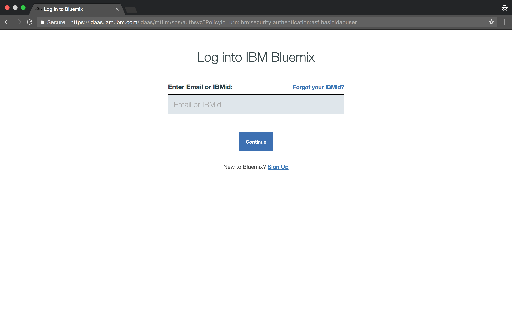
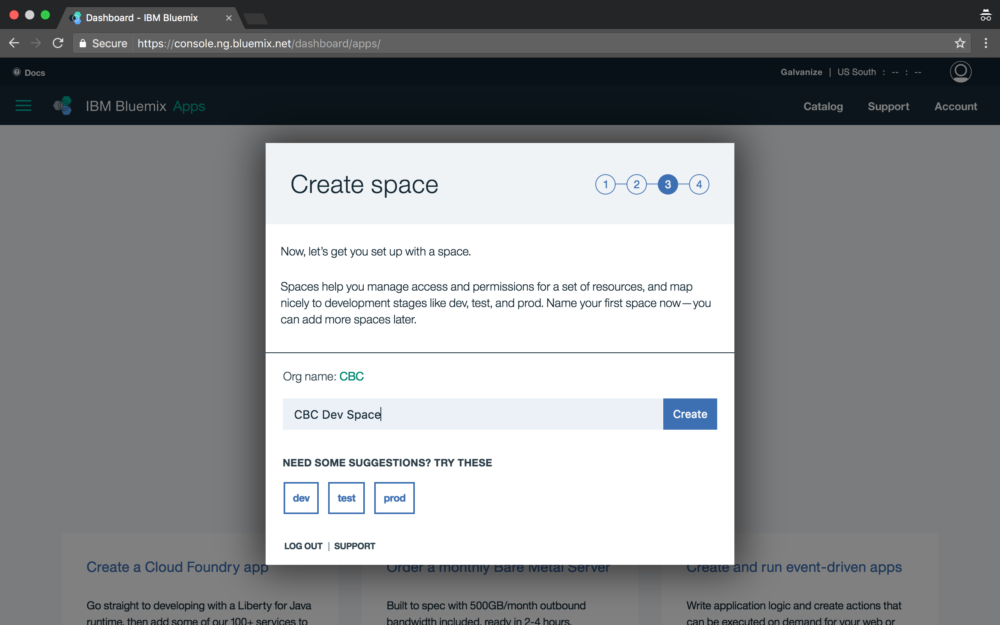
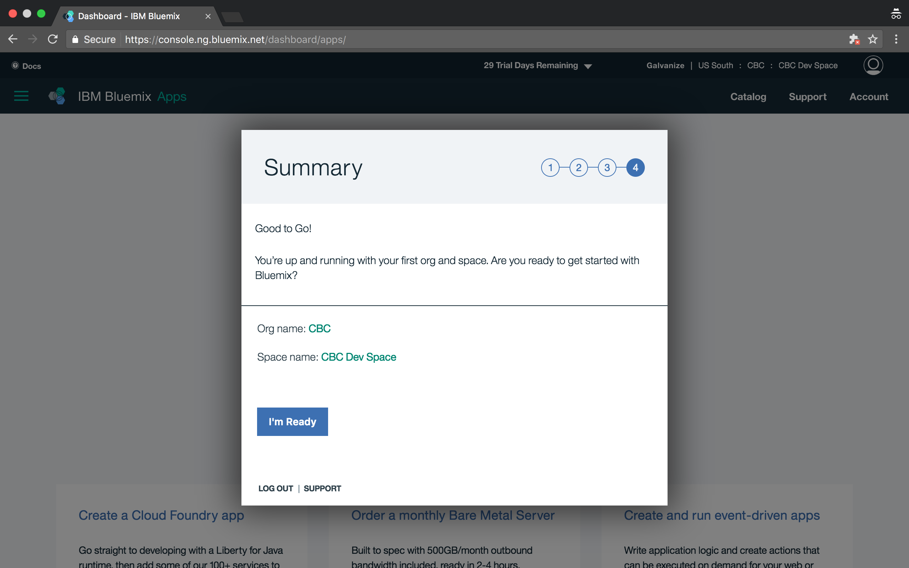
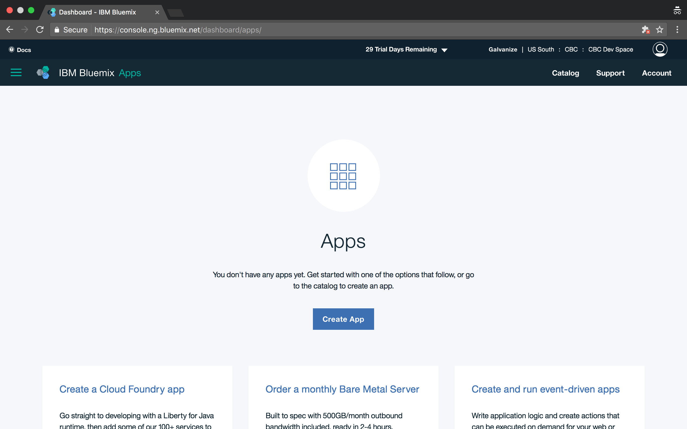

# Create your Bluemix account

**Requirements**: None specific. You just need a web browser, and be able to connect to your email account and to the IBM Bluemix console.

## Objectives & Outlines

By the end of this lesson, you should be able to:
- **access the IBM Bluemix console**

Description of this lesson:
- **Type**: step-by-step tutorial
- **Estimated time for completion**: 20 mins.

## Rationale

IBM Bluemix is a **platform** that provides machine learning / artificial intelligence **components**.

Designing a product based on Bluemix/Watson will require to **create instances** of the available components, and **open permissions** for your application to connect to them. When required by your application, these components will be **executing on IBM's cloud**.

The components of that platform are made available through a **web console**. You will use that web console to **manage the components** you want to embed into your applications. To access tha web console, you need to create an IBM Bluemix account.

_Note: Opening an account creates a free 1 month trial period. In that period most of the Watson component will be provided for free._

## Note: read this first if you are participating to a Cognitive Builder Faire

**You should have received in your email a promo code giving you access to a 90 days trial for the BlueMix platform. Use this email for registering first. If you follow the guidelines below, you will have access only to a 30 days trial.**

## \#1 Register for an IBM Bluemix account

1. Using your browser, go to [https://console.ng.bluemix.net/registration/](https://console.ng.bluemix.net/registration/). Fill in your information and click on **"Create Account"** when ready.

  

2. Once completed, IBM Bluemix will send you an email for completing your registration.

  

3. Once confirmed, go to [https://console.ng.bluemix.net/login/](https://console.ng.bluemix.net/login/) for accessing the platform.

  

## \#2 Setting up your account

_Note: that section may happen differently if you've already created an IBM account through the Data Science Experience registration process. You don't need to use the specific organization and space names._

1. Login into the [IBM Bluemix Console](https://console.ng.bluemix.net/login/).

  

2. On the first login, IBM Bluemix will ask you to setup a few things. After you have accepted the conditions (**step 1**), you need to create an organization (**step 2**). You can use "CBC-yourname" as your organization name, or something else you'd like.

  

3. Next, you will need to create a space (**step 3**). It will be a simplified way to handle the components you create, and manage the permissions. You can use "CBC Dev Space" in there, or anything else you'd like.

  

4. Verify your informations and click on **"I'm Ready"**.

  

5. You now have access to your IBM Bluemix console and dashboard. Congratulations, your account is open !

  
