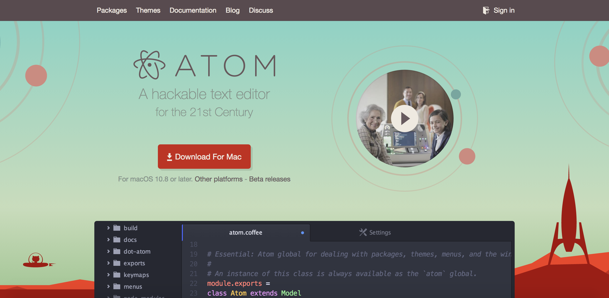

# Install Atom

**Requirements**: none specific.

## Objectives & Outlines

By the end of this lesson, you should be able to:
- **edit text using Atom**

**Type**: step-by-step tutorial

**Estimated time for completion**: 5 mins.

## Install Atom on MAC

1. Go to atom's website [atom.io](https://atom.io). On the landing page, identify the red download button (it should correspond to your system):

  

2. It will download a zip file `atom-mac.zip`. Click on this file to expand the Atom executable.

3. Click on the Atom executable to run atom. On the first start, it should install the `atom` command into your terminal.

## Install Atom on Linux

1. Go to atom's website [atom.io](https://atom.io). On the landing page, identify the red download button (it should correspond to your system).

2. It will download a packaged file corresponding to your system. In Ubuntu/Debian it would be `atom-amd64.deb`.

3. In a terminal, get into the directory you downloaded this file into, and run `sudo dpkg -i atom-amd64.deb` to run the installer.

## Install Atom on Windows

1. Go to atom's website [atom.io](https://atom.io). On the landing page, identify the red download button (it should correspond to your system).

2. It will download a zip file `atom-windows.zip`. Click on this file to expand the Atom folder.

3. Within that folder, click on the Atom executable to run atom.
