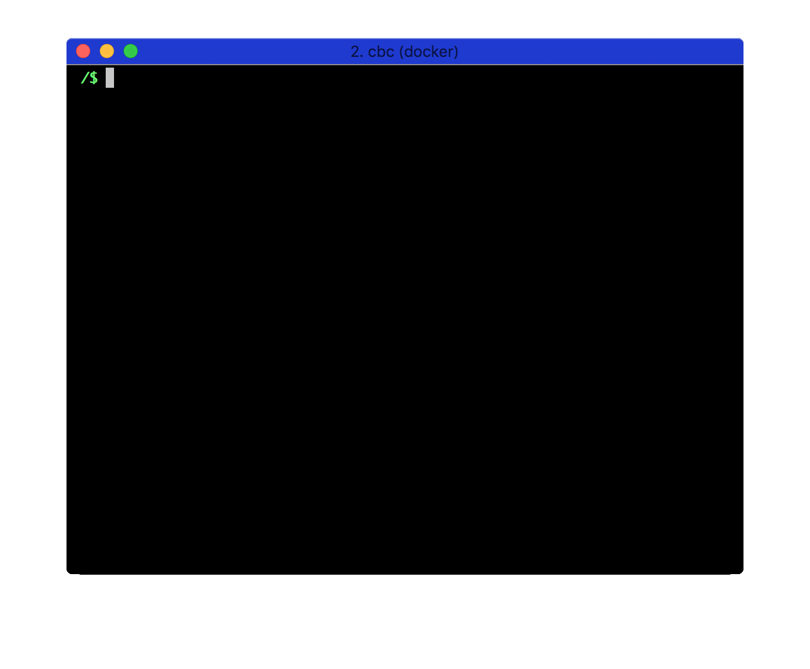

# Install Anaconda

**Requirements**: You need to have completed the [Atom installation tutorial](atom_install.md).

## Objectives & Outlines

By the end of this lesson, you should be able to:
- **get into an environment in Anaconda**
- **execute python code in that environment**

Description of this lesson:
- **Type**: step-by-step tutorial
- **Estimated time for completion**: 30 mins.

## Rationale

Python is a programming language. The core value of Python resides in the numerous modules and libraries that go with it. There are modules for data science, for plotting... and of course a module for using IBM Watson.

Each module is a project of its own, with its own development pace and version control. That is why it is very helpful to rely on a Python distribution such as Anaconda. Anaconda packages some (not to say most) of the core modules necessary to code scripts in Python. It provides a simple, reliable, access point for managing your installation of Python.

More than that, Anaconda offers to let you create "environments". They are contained installations of Python (like a bubble in which you find a specific set of versions of Python and its modules). Using environments, you can work on a single computer with multiple installations of Python (version 2 or version 3) and its main modules.

As an example of a good practice, when installing a complex library such as [OpenCV](http://docs.opencv.org/2.4/doc/tutorials/tutorials.html) that may be functional with only some very specific versions of Python modules, it is recommend to create an environment of its own and make it work there first. That way, you don't mess up with the rest of your installation (for instance the one you're working with on a specific project).

We propose to create a specific environment we'll call `cbc` to work with in this course.

## \#1 Install Python/Anaconda 3

**If you already have anaconda installed, you can skip this section and go directly to \#2**.

Depending on your configuration, please choose among the instructions below.

### \#1.1 Install on MacOSX

In a terminal, run the following lines:

```bash
wget -O $HOME/anaconda.sh https://repo.continuum.io/archive/Anaconda3-4.3.0-MacOSX-x86_64.sh
bash $HOME/anaconda.sh -b -p $HOME/anaconda
echo "export PATH=$HOME/anaconda/bin:$PATH" >> $HOME/.bashrc
rm $HOME/anaconda.sh
source $HOME/.bashrc
conda update -y conda
```

This will install Anaconda3 in your home directory, under subdirectory `anaconda`.

_If you want to run a different installation process, please refer to the [Anaconda Installation (official) guidelines](https://docs.continuum.io/anaconda/install#anaconda-for-macos-command-line-install)._

### \#1.2 Install on Linux

In a terminal, run the following lines:

```bash
wget -O $HOME/anaconda.sh https://repo.continuum.io/archive/Anaconda3-4.3.0-Linux-x86_64.sh
bash $HOME/anaconda.sh -b -p $HOME/anaconda
echo "export PATH=$HOME/anaconda/bin:$PATH" >> /home/cbc/.bashrc
rm $HOME/anaconda.sh
source $HOME/.bashrc
conda update -y conda
```

This will install Anaconda3 in your home directory, under subdirectory `anaconda`.

_If you want to run a different installation process, please refer to the [Anaconda Installation (official) guidelines](https://docs.continuum.io/anaconda/install#linux-install)._



### \#1.3 on Windows

Please refer to the [Anaconda Installation (official) guidelines](https://docs.continuum.io/anaconda/install#anaconda-for-windows-install)._


## \#2 Create an environment for cbc

**Do the following in a terminal**.

1. Create an environment called `cbc` by typing:

  ```bash
  conda create --name cbc -y python=3 anaconda
  ```

  _This will ask Anaconda to create an environment named `cbc`, and install Python 3 in that environment, along with all the Anaconda packages. The `-y` option forces the installation of the dependencies._
  _Note: Python 3 is not necessary for the Watson API. If you prefer to use Python 2 change this command to the following:_
  ```bash
  conda create --name cbc -y python=2.7 anaconda
  ```

2. Enter your `cbc` environment:

  ```bash
  source activate cbc
  ```

3. Try the following command :

  ```bash
  python --version_info
  ```

  It should return:

  ```
  Python 3.6.0 :: Continuum Analytics, Inc.
  ```

4. To exit the conda environment, type:

  ```bash
  source deactivate
  ```

5. The unix command `which` indicates where to find a given program that is executed. For instance,

  ```bash
  which ls
  ```

  will return `/bin/ls` which is the location of that program. Use `which python` outside and inside the conda cbc environment to see where `python` is located in both cases.

  

  You will observe that locations are different. When you're outside the conda cbc environment (before using `source activate cbc`), typing `python` will call main anaconda python. When you're inside that cbc environment (after using `source activate cbc`), typing `python` will call the python located inside the cbc environment you just created.


## Check your work 💪

In order to test your python installation, we propose to run a simple python example.

1. Now, use atom to create a new file named `hello_python.py`:

  ```bash
  atom hello_python.py
  ```

2. In that file, copy/paste the following lines. Save the file.

  ```python
  import sys

  print("Hello World!")
  print("I'm running Python {}".format(sys.version_info[0]))
  ```

3. Execute this python script inside the conda cbc environment (be sure you have used `source activate cbc`).

  ```bash
  python hello_python.py
  ```

  It should output:

  ```
  Hello World!
  I'm running Python 3
  ```

  This just means you just joined the never-ending flow of developers having made it through a new language installation tutorial... welcome !
