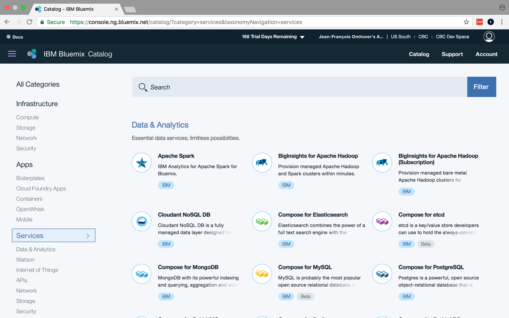
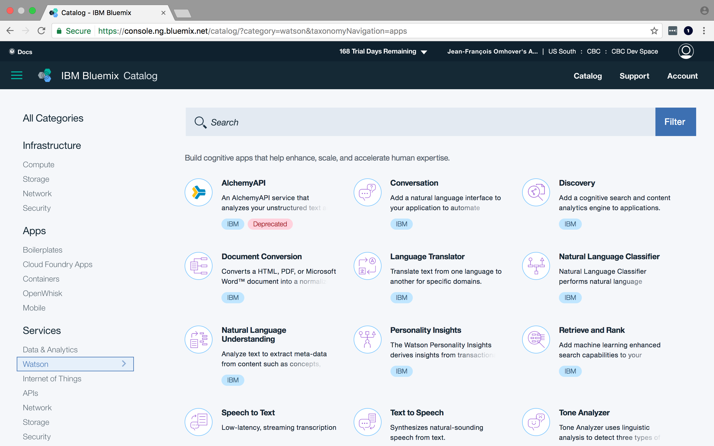
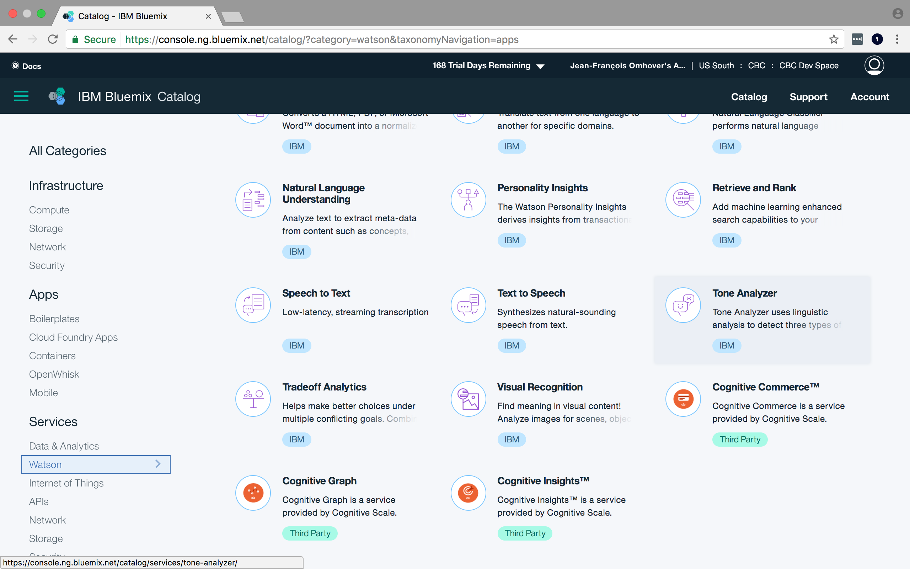
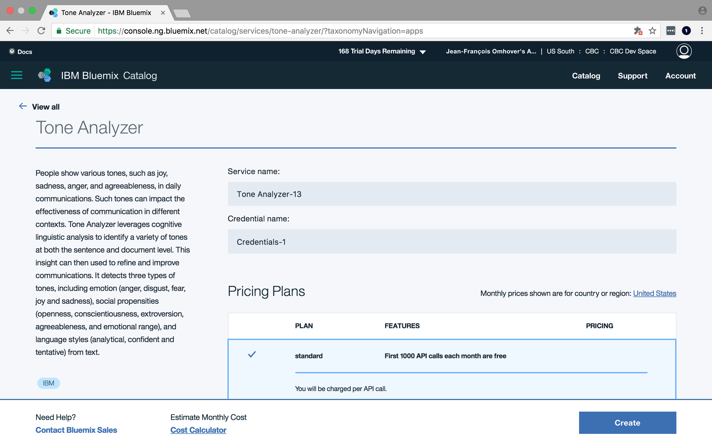

# Create a component instance

**Requirements**: You need to have completed the [Prerequisites Unit](../prerequisites/README.md).

## Objectives & Outlines

By the end of this lesson, you should be able to:
- **create instances of components of the IBM Watson platform**

Description of this lesson:
- **Type**: step-by-step tutorial
- **Estimated time for completion**: 5 mins.

**Note:** If you already have created an instance and want to find it, use [this lesson](2-find_your_instances.md).

## \#1 Create an Instance of Tone Analyzer

1. Go to the [Service Dashboard](https://console.ng.bluemix.net/dashboard/services) page of the Bluemix console.

  

2. On the landing page, click on **"Create Service"** to open the Bluemix catalog.

  

3. On the left bar, click on **"Watson"** or scroll down to find the Watson components.

  

4. Look for **"Tone Analyzer"** and click on it.

  

  It opens the description page of the component.

5. Click on **"Create"** to create an instance of Tone Analyzer.

  

## Check your work 💪

To verify that your instance has been created, go to the [Service Dashboard](https://console.ng.bluemix.net/dashboard/services) page of the Bluemix console. You should see now a list of the existing instances.

If your landing page looks like this instead:

it means you haven't any created instance (try to scroll down to see if the list).
