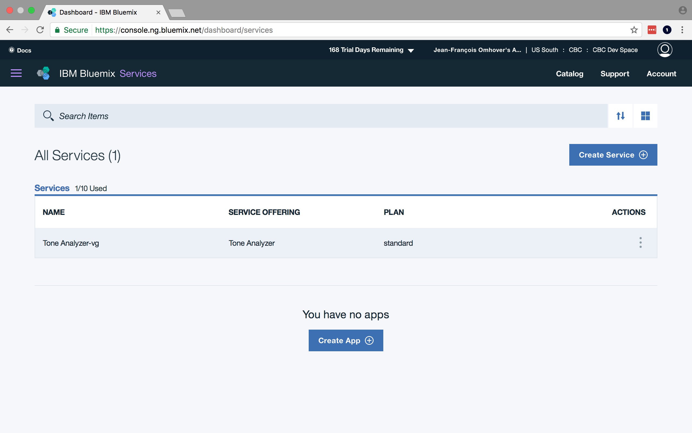
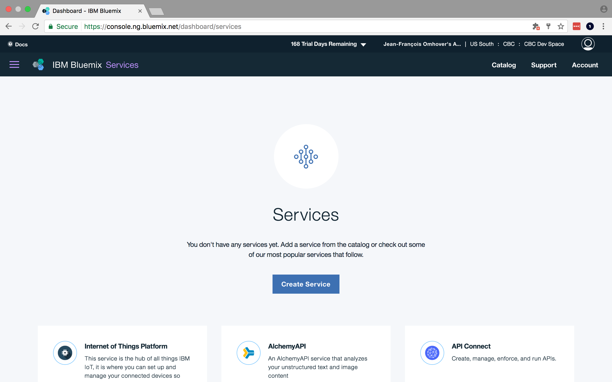
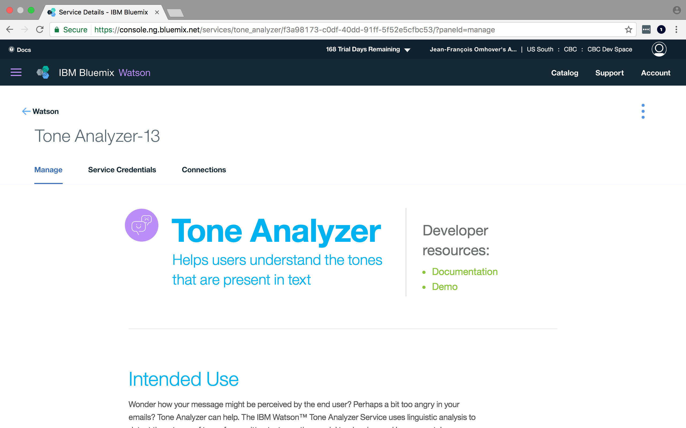

# Find your instances

**Requirements**: You need to have completed the [Creation of an instance](1-create_instance.md).

## Objectives & Outlines

By the end of this lesson, you should be able to:
- **find your existing instances on the IBM Bluemix console**
- **access the service management page for a given service**

Description of this lesson:
- **Type**: step-by-step tutorial
- **Estimated time for completion**: 5 mins.

## \#1 Find and open an existing service instance

1. Go to the [Service Dashboard](https://console.ng.bluemix.net/dashboard/services) page of the Bluemix console.

2. If you have some existing instances, it should provide a list of those:

  

  If instead your landing page looks like this instead:

  

  it means you haven't any created instance (try to scroll down to see if the list).

  You should then report to the lesson on [creating instances of services](1-create_instance.md)

3. Click on the existing **"Tone Analyzer"** instance to access the instance management page.

  
