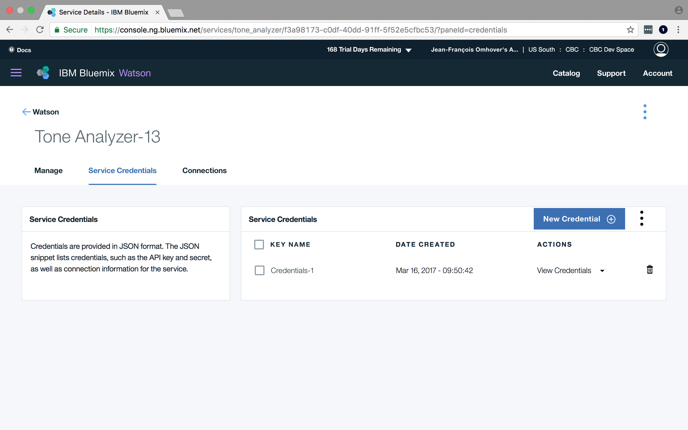

# Setup your Credentials

**Requirements**: You need to have completed the [Creation of an instance](1-create_instance.md), and be able to [Find your instances](2-find_your_instances.md).


## Objectives & Outlines

By the end of this lesson, you should be able to:
- **obtain your credentials for a given component**
- **setup your credentials in a local file**
- **use your credentials to connect to an instance**

Description of this lesson:
- **Type**: step-by-step tutorial
- **Estimated time for completion**: 10 mins.


## \#1 Get your credentials from the console

1. From the [Service Dashboard](https://console.ng.bluemix.net/dashboard/services), access the existing instance of Tone Analyzer (see lesson [find your instances](2-find_your_instances.md)).

  


2. Click on panel **"Service Credentials"**

  


3. From there click on **"View Credentials"**, then on the **"Copy"** icon on the top-right corner. It will put the credential JSON string into clipboard.

  


## \#2 Write a credentials file into your code directory

1. Open atom to edit the file [`code/.env-example`](.env-example). You should see the following content in there:

  ```
  TONE_USERNAME="..."
  TONE_PASSWORD="..."
  ```

  Modify this file by replacing the `"..."` on the lines above with your username and password from the credentials of the Tone Analyser service you copied above.

  Now save that file to `.env` insode `code/` instead of `.env-example`. The file `.env` had been added to the `.gitignore` of this repository so that **it should NEVER BE PUSHED** into your fork. You wouldn't want the entire world to share your credentials.


## Check your work 💪

Go to [the next lesson](4-hello_tone_analyzer.md) for testing your credentials using the ToneAnalyzer example code.
