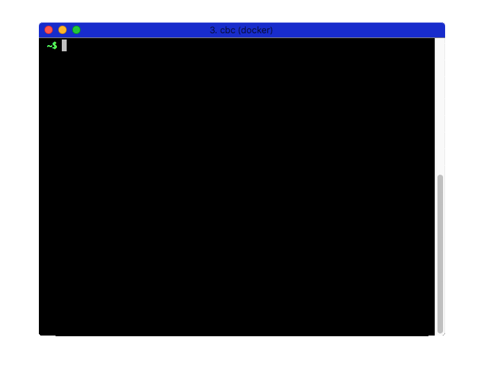

# Run Tone Analyzer

**Requirements**: You need to have completed the [Creation of an instance](1-create_instance.md), and be able to [Find your instances](2-find_your_instances.md). You need to have [setup and checked your credentials for tone analyzer](3-setup_credentials.md).


## Objectives & Outlines

By the end of this lesson, you should be able to:
- **call the Tone Analyzer through your credentials**
- **analyze the structure of the responses provided by Tone Analyzer**

Description of this lesson:
- **Type**: step-by-step tutorial
- **Estimated time for completion**: 10 mins.


## \#1 Run the example code

In a terminal.

1. Enter the `cbc` anaconda environment.

2. Get into the code directory of this repository.

3. Run the script [`code/toneanalyzer.py`](../code/toneanalyzer.py) using:

  ```bash
  python toneanalyzer.py
  ```

  inside the code directory.

4. When prompted, submit the sentence `What exactly is this output ?!?`.

  

  What you see here is a dump of the JSON response obtained from Tone Analyzer.

5. Can you spot which part of that structure contains emotional tones ?


## Check your work 💪

When running the script above with the sentence `I totally rocked that thing!`

Identify the line containing the score detected for Joy:

  ```
  "score": 0.595477,
  ```
