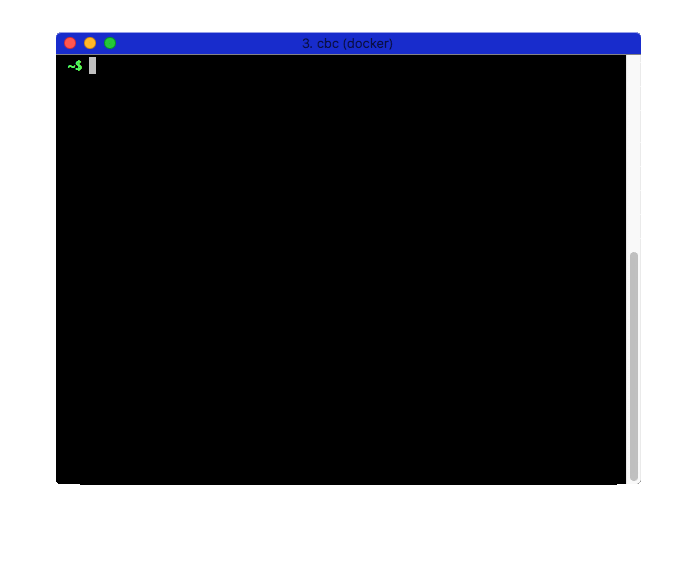

# Analyze This!

**Requirements**: You need to have completed [all four lessons of this unit](README.md)

## Objectives & Outlines

By the end of this exercise, you should be able to:
- **analyze sentiments and emotions in sentences using Tone Analyzer responses**

## Brief

Modify the script `code/toneanalyzer.py` provided in this repository to integrate the following changes:

- For every input sentence, it should display all the scores obtained for each of the 5 emotional tones `Anger, Disgust, Fear, Joy, Sadness`.
- It should display each emotional tone with its corresponding `score` on a separate line using the format `Label, score`.
- You can display these lines in any given order.

Here is an example of what it should look like:

